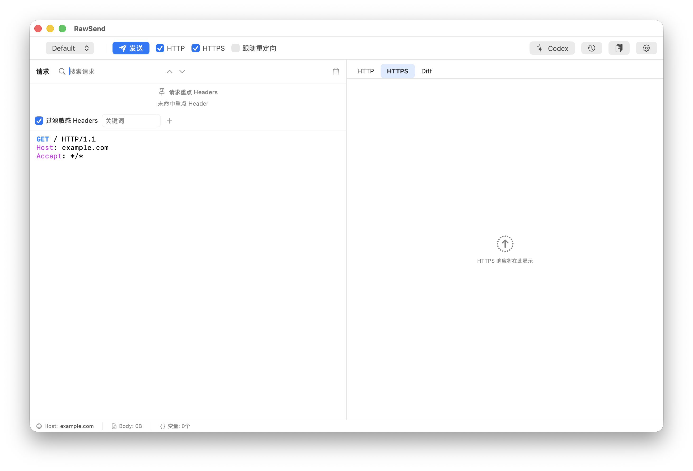

<p align="center">
  
</p>

<h1 align="center">RawSend</h1>

<p align="center">
  <strong>轻量、专注、面向原始 HTTP 报文的 macOS 发包工作台。</strong>
</p>

<p align="center">
  粘贴 raw request，精确复现；不需要项目配置，不需要笨重集合，不做隐式修改。
</p>

<p align="center">
  <a href="README.md">English README</a> ·
  <a href="https://github.com/MayMistery/RawSend/releases/latest">最新版本</a>
</p>



## 为什么需要 RawSend

很多 HTTP 工具默认围绕“接口集合”和“项目管理”设计。做长期 API 维护时这很有用，但在安全测试、线上排查、漏洞复现和一次性请求回放里，真正的事实来源往往已经是一段完整的 raw request：来自代理、终端、日志、工单或报告。

RawSend 刻意保持更小的形态：

- **Raw-first**：直接在粘贴进来的原始请求上编辑。
- **Local-first**：配置、历史、日志和 prompt 默认都在本机。
- **Evidence-preserving**：敏感字段可以划掉并跳过发送，但不会从复现材料里消失。

它想做好的就是一个短链路：粘贴请求，划掉不该发送的字段，发包，搜索响应，对比 HTTP/HTTPS，查看重定向，最后把完整请求/响应留在本地历史里。

## 核心工作流

1. 粘贴完整 raw HTTP 请求。
2. 在原文中修改 header、URL 参数和 body。
3. 把鉴权或敏感字段划掉，而不是删除。
4. 通过 HTTP、HTTPS 或两者同时发送。
5. 搜索、语法高亮、预览和对比响应。
6. 从本地历史重新打开完整请求/响应对。

## 关键能力

- **原始请求就地编辑**：直接操作原始 HTTP 文本，header 和 URL 参数不会被拆到另一个容易和 raw request 脱节的表单里。
- **粘贴 curl 即转换**：把 `curl` 命令粘贴进请求编辑器会自动转换成可直接发送的 raw request，并根据 URL 协议自动设置 HTTP/HTTPS 开关。覆盖面广——`-X`、`-H`、`-d`/`--data*`、`--data-urlencode`、`--json`、`-F`/`--form`（multipart）、`-u`、`--oauth2-bearer`、`-b`、`-A`、`-e`、`-r`、`-G`、`-I`、`--compressed`、`--url`——并支持多行 `\`/`^` 续行与 `$'...'` 引用，兼容 DevTools、Postman、Insomnia 复制出的写法。
- **敏感字段划掉**：支持手动划掉 header 和 query 参数，也支持按可配置关键词批量划掉。被划掉的字段仍可见，但发包和导出 cURL 时会跳过。
- **不卡 UI 的全文搜索**：请求和响应搜索使用 [FindFaster](https://github.com/finnvoor/FindFaster)，支持匹配高亮、上/下一个跳转和行列定位。
- **响应更可读**：Raw 响应视图会高亮状态行、header、JSON 和 HTML；HTML 响应还可以切到内置 Preview 查看渲染结果。
- **重点元数据聚合**：可配置一组重要请求头，按大小写不敏感方式聚合展示 request id、trace、路由和服务相关元数据，让关键信息可见但不挤占编辑区。
- **HTTP/HTTPS 对比**：同一份 raw request 可以同时走 HTTP 和 HTTPS，并查看响应差异。
- **重定向显式控制**：默认不跟随重定向；当出现 `3xx` 响应时，在发送区域附近提供明确的跟随动作。
- **历史保存响应**：本地历史保存请求和响应对，复现过的 case 可以重新打开，不必再次发包。
- **本地 Codex 集成**：可选调用本机 `codex` CLI，识别请求/响应中的风险字段，并执行结构化动作，比如划掉鉴权相关输入。
- **多语言 UI**：默认英文，可在设置里切换简体中文和西语。

## RawSend 不是什么

RawSend 不是代理，不是团队 API 工作区，也不是浏览器 DevTools 的替代品。它只专注一个窄场景：快速、本地、低干扰地复现和检查完整 HTTP 报文。

## 本地文件

运行时配置目录：

```text
~/Library/Application Support/RawSend/
```

日志目录：

```text
~/Library/Logs/RawSend/
```

超过 200ms 的慢搜索、渲染、diff 和格式化操作会写入：

```text
~/Library/Logs/RawSend/performance.jsonl
```

发包失败会写入可复制的诊断信息：

```text
~/Library/Logs/RawSend/send-errors.jsonl
```

RawSend 仓库只发布通用产品默认值。组织特定的默认 header、路由元数据或 User-Agent 应放在本机配置里，而不是写进仓库。

## 安装

从 [GitHub Releases](https://github.com/MayMistery/RawSend/releases/latest) 下载最新 `.pkg`。

Apple Silicon：

```bash
sudo installer -pkg RawSend-1.0.1-macos-arm64.pkg -target /
```

Intel Mac：

```bash
sudo installer -pkg RawSend-1.0.1-macos-x86_64.pkg -target /
```

安装后应用位于：

```text
/Applications/RawSend.app
```

如果没有可用 Developer ID 证书，release 包可能没有正式签名。macOS 拦截时可以显式移除 quarantine：

```bash
sudo xattr -d com.apple.quarantine RawSend-1.0.1-macos-arm64.pkg
sudo installer -pkg RawSend-1.0.1-macos-arm64.pkg -target /
sudo xattr -dr com.apple.quarantine /Applications/RawSend.app
```

也可以在 Finder 里按住 Control 点击安装包或应用，然后选择“打开”。

## 从源码构建

要求：

- macOS 14 或更新版本
- Xcode Command Line Tools
- Swift 5.9 或更新版本

常用检查：

```bash
swift build
make check
make codex-check
```

构建并安装到本机：

```bash
make install
```

生成 arm64 和 x86_64 两个安装包：

```bash
make release
```

产物目录：

```text
.build/packages/
```

正式 Developer ID 签名：

```bash
make release \
  CODESIGN_IDENTITY="Developer ID Application: Your Name (TEAMID)" \
  PKG_SIGN_IDENTITY="Developer ID Installer: Your Name (TEAMID)"
```

没有这些签名身份时，RawSend 会使用 ad-hoc app 签名，安装包不做 Developer ID 签名。

## Codex 集成

RawSend 可以调用本地 `codex` CLI 做结构化分析。默认会查找 `PATH`、`/opt/homebrew/bin` 和 `/usr/local/bin`。如果二进制在其他位置，可以设置：

```bash
export RAWSEND_CODEX_PATH=/path/to/codex
```

本地端到端检查：

```bash
make codex-check
```

设置页只需要填写用户 prompt。系统 prompt 由 RawSend 内置，用于约束 Codex 输出风险行、建议关键词和可执行的划掉动作。

## 隐私

RawSend 是 local-first。配置、历史、诊断和性能日志都保存在你的 Mac 上。Codex 是否连接外部模型服务取决于你本机 Codex CLI 的配置。被划掉的 header 和 URL 参数仍会显示，方便审计和复现，但不会参与实际发包和 cURL 导出。

## 许可证

RawSend 使用 [MIT License](LICENSE)。
